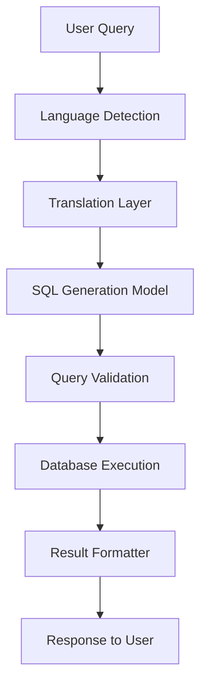

# 🌐 Multi-Lingual Query Engine

> 🚀 An intelligent engine that converts natural language into executable SQL queries — enabling seamless, multi-lingual database interaction.

---

## 🧠 Overview

The **Multi-Lingual Query Engine** is an advanced AI-driven system that bridges human language and structured databases.  
It allows users to **ask questions in multiple languages** and automatically **translates them into optimized SQL queries**, executes them, and returns contextualized results.

This project demonstrates the power of **NLP + SQL automation** and serves as a foundation for **language-agnostic data querying systems**.

---

## 🏗️ Architecture

**Core Components:**

- **`api.py`** → Exposes FastAPI endpoints for query input and response delivery.  
- **`database.py`** → Manages database connections, schema validation, and query execution.  
- **`definitions.py`** → Defines configuration parameters, models, and schema mappings.  
- **`driver.py`** → Main orchestration script that integrates all components for end-to-end execution.  
- **`sql_generation.py`** → Converts natural language queries (across multiple languages) into SQL using transformer-based models.  
- **`sql_model.py`** → Loads and fine-tunes language-to-SQL generation models.  
- **`vector_store.py`** → Embedding and semantic storage for cross-lingual understanding and context retention.  
- **`workflow.py`** → Coordinates the end-to-end query flow — from input processing → translation → SQL generation → execution → result formatting.  

---

## ⚙️ Tech Stack

- **Languages:** Python  
- **Frameworks:** FastAPI, Transformers  
- **ML Libraries:** Hugging Face, Sentence Transformers  
- **Database:** PostgreSQL / MySQL (configurable)  
- **Other Tools:** LangChain, SQLAlchemy, Docker  

---

## 🔍 Features

✅ Natural language to SQL generation (supports multiple languages)  
✅ Transformer-based language model for high query accuracy  
✅ Real-time SQL query validation and execution  
✅ Modular API-driven architecture  
✅ Semantic vector search for context-aware query handling  
✅ Extensible to any database or LLM-based backend  

---

## 🧩 Workflow

1. User enters a **query in any language**  
2. System translates it to **English (if needed)**  
3. Model generates the **corresponding SQL query**  
4. SQL is executed via the **database module**  
5. Results are formatted and returned as **JSON or text response**  


---
## Getting Started
### 1. Clone Repo 
```bash
git clone https://github.com/Adity-star/Multi-Lingual-Query-Engine.git
cd Multi-Lingual-Query-Engine
```
### 2. Create and activate virtual environment,
```bash
python -m venv venv
source venv/bin/activate   # or venv\Scripts\activate on Windows
```
### 3. Install Dependencies
```bash
pip install -r requirements.txt
```
### 4. configure Environment.
```bash
DATABASE_URL=your_database_connection
MODEL_PATH=path_to_your_transformer_model
```
### 5. Run the API
```bash
uvicorn api:app --reload
```
## Example Usage.
```bash
¿Cuántos usuarios se registraron en enero?
```
- Generated SQl
```sql
SELECT COUNT(*) FROM users WHERE registration_date BETWEEN '2025-01-01' AND '2025-01-31';
```
- Response
```bash
There were 1,242 users registered in January.
```
---
### Traebility
- Also  trace each steps in langgraph


---
### Author
Aditya Akuskar
- [Linkedin](https://www.linkedin.com/in/aditya-a-27b43533a/)
  
